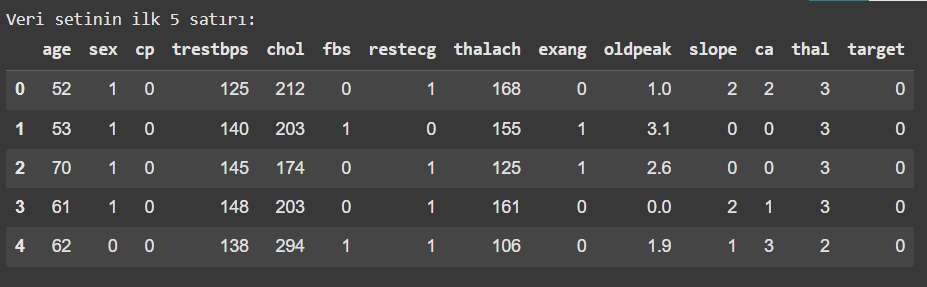
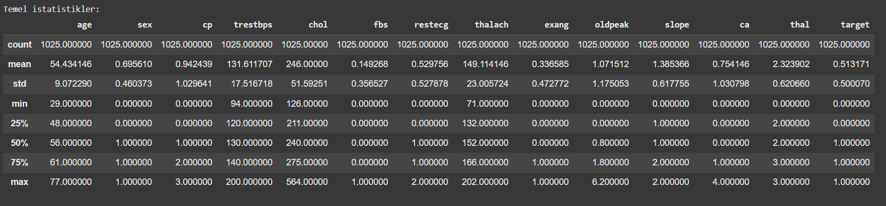
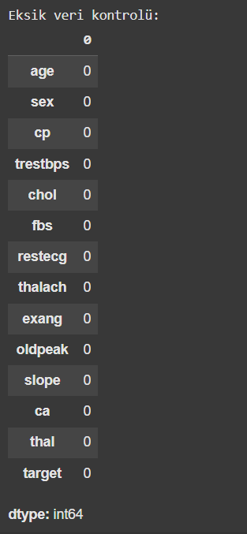
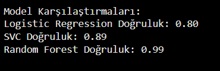
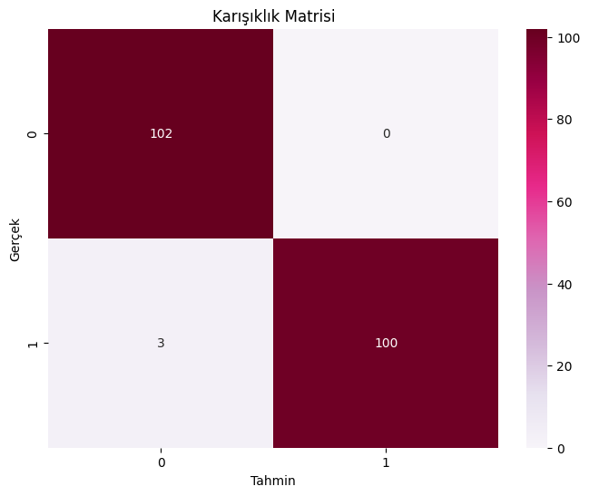
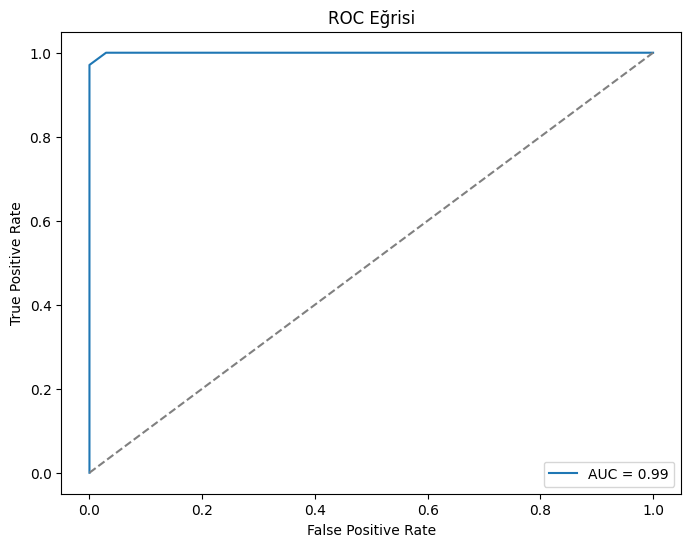
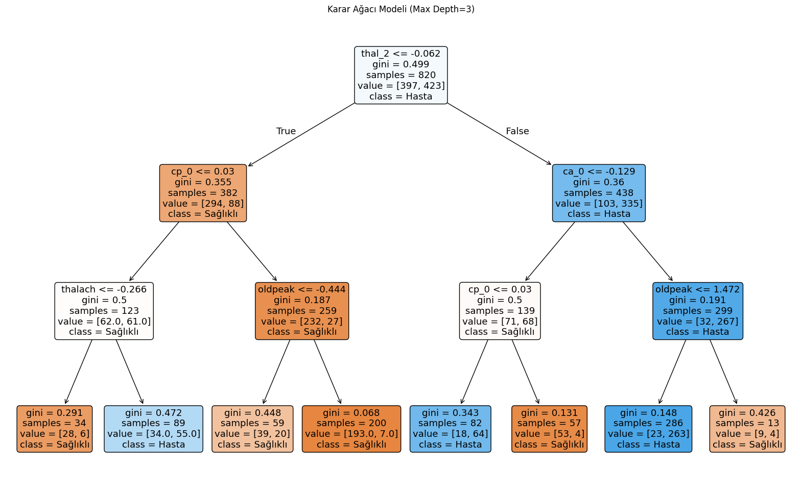

#  💓 Kalp Hastalığı Tahmini - Makine Öğrenmesi Projesi

Bu proje, **Akbank Makine Öğrenmesi Bootcamp** kapsamında gerçekleştirilmiş olup, kalp hastalığı verisi üzerinden gözetimli öğrenme teknikleri ile bir sınıflandırma modeli geliştirmeyi amaçlamaktadır. Projenin sonunda, gerçek dünya senaryosuna uygulanabilecek, istatistiksel olarak anlamlı ve yorumlanabilir bir makine öğrenmesi modeli oluşturulmuştur.

## İçindekiler
- [Proje Tanımı](#proje-tanımı)
- [Veri Kümesi](#veri-kümesi)
- [Kullanılan Yöntemler](#kullanılan-yöntemler)
- [Veri Ön İşleme](#veri-ön-işleme)
- [Modelleme ve Hiperparametre Optimizasyonu](#modelleme-ve-hiperparametre-optimizasyonu)
- [Model Karşılaştırması](#model-karşılaştırması)
- [Model Değerlendirme](#model-değerlendirme)
- [Sonuçlar](#sonuçlar)
- [Gerçek Hayat Uygulaması](#gerçek-hayat-uygulaması)
- [Github linki](#Github_linki)
- [Kaggle Notebook](#kaggle-notebook)
- [Kullanılan Kütüphaneler](#kullanılan-kütüphaneler)

---

## 📖 Proje Tanımı

Amaç, bir bireyin belirli sağlık göstergeleri ve klinik verileri (yaş, cinsiyet, kolesterol seviyesi, EKG sonucu vb.) üzerinden kalp hastalığına sahip olup olmadığını tahmin eden bir sınıflandırma modeli geliştirmektir.

Bu projede:
- Keşifsel veri analizi yapılmış,
- Veriler uygun şekilde ön işlenmiş,
- Farklı makine öğrenmesi algoritmaları denenmiş,
- En iyi sonuç veren model optimize edilerek detaylı biçimde değerlendirilmiştir.

---

## Veri Kümesi

Veri seti, [Kaggle](https://www.kaggle.com/datasets/johnsmith88/heart-disease-dataset) platformundan alınmış olan klasik bir "Heart Disease " veri setidir. Bu veri seti:
###  verisetinin ilk beş satrı 

### Temel istatistikler

### Eksik veri kontrolü

içermektedir.


---

## Kullanılan Yöntemler

Bu proje kapsamında aşağıdaki makine öğrenmesi algoritmaları denenmiştir:

- **Random Forest Classifier** (ana model)
- **Logistic Regression**
- **Support Vector Classifier (SVC)**
- **Decision Tree görselleştirme**

Ana model olarak Random Forest tercih edilmiştir çünkü:
- Feature importance analizi sağlar
- Non-lineer ve karmaşık ilişkileri yakalayabilir
- Aşırı öğrenmeye karşı dirençlidir

---

## Veri Ön İşleme

Veri seti üzerinde aşağıdaki ön işleme adımları uygulanmıştır:

- Eksik veri kontrolü (veri setinde eksik veri bulunmamaktadır)
```
# Eksik veri kontrolü
print("\nEksik veri kontrolü:")
display(df.isnull().sum())
```

- Kategorik değişkenler için One-Hot Encoding
- Sayısal değişkenler için StandardScaler ile normalizasyon
- Eğitim ve test verisinin %80-%20 oranında ayrılması
 ```
  # Kategorik ve sayısal değişkenlerin ayrılması
cat_cols = ['sex', 'cp', 'fbs', 'restecg', 'exang', 'slope', 'ca', 'thal']
# Kategorik değişkenler (sınıflandırılabilir, label'lara sahip sütunlar)

num_cols = [col for col in df.columns if col not in cat_cols and col != 'target']
# Sayısal değişkenler: Kategorik olmayan ve hedef değişken ("target") dışında kalan sütunlar

# One-hot encoding
df_encoded = pd.get_dummies(df, columns=cat_cols)
# Kategorik değişkenleri ikili (binary) formatta kodlayarak model için uygun hale getirir

# Bağımsız ve bağımlı değişkenler
X = df_encoded.drop('target', axis=1)  # Bağımsız değişkenler: hedef değişken dışındaki tüm sütunlar
y = df_encoded['target']  # Bağımlı değişken: tahmin edilmek istenen hedef sütunu

# Verinin ölçeklendirilmesi
scaler = StandardScaler()  # StandardScaler nesnesi oluşturulur (ortalama=0, std=1 olacak şekilde ölçekler)
X_scaled = scaler.fit_transform(X)  # Tüm bağımsız değişkenler ölçeklendirilir

# Eğitim-test ayrımı
X_train, X_test, y_train, y_test = train_test_split(
    X_scaled, y, test_size=0.2, random_state=42
)  # Veriler %80 eğitim, %20 test olarak ayrılır. random_state sabitlenerek tekrarlanabilirlik sağlanır
```

---

## Modelleme ve Hiperparametre Optimizasyonu

Ana model olarak kullanılan **Random Forest** için GridSearchCV ile hiperparametre optimizasyonu yapılmıştır. Aşağıdaki parametreler denenmiş ve en iyi kombinasyon belirlenmiştir:

- `n_estimators`: [50, 100, 200]
- `max_depth`: [5, 10, None]
- `min_samples_split`: [2, 5, 10]

> **En iyi parametreler:** `{'n_estimators': 100, 'max_depth': 10, 'min_samples_split': 2}`

---

## Model Karşılaştırması



Random Forest, en yüksek doğruluk oranı ve AUC-ROC skoruna ulaşmıştır.

---


## 🔍 Model Değerlendirme 

### 🎯 Karışıklık Matrisi (Confusion Matrix)


### 📈 ROC Eğrisi (ROC Curve)


### 📊 Özellik Önemlilik Grafiği (Feature Importance)


### 🌳 Karar Ağacı Görselleştirmesi



sunulmuştur.

---

## Sonuçlar

Random Forest modeli, yüksek doğruluk ve AUC skoru ile kalp hastalığı tahmininde oldukça başarılı bir performans sergilemiştir. Modelin yorumlanabilirliği ve klinik öngörülerle örtüşmesi, gerçek dünya uygulamalarında kullanılabilirliğini artırmaktadır.

---

## Gerçek Hayat Uygulaması

Bu model, sağlık kurumlarında:
- Ön tarama aracı olarak,
- Riskli bireylerin belirlenmesinde,
- Klinik karar destek sistemlerinde,

kullanılabilir.


---

## Kaggle Notebook

> https://www.kaggle.com/code/selamalabdo/heartdiseaseprediction

---
---

## github 

> https://github.com/selamalabdo/KalpHastaligiTahmini.git

---

## 📦 Kullanılan Kütüphaneler


- [NumPy](https://numpy.org/)
- [Pandas](https://pandas.pydata.org/)
- [Matplotlib](https://matplotlib.org/)
- [Seaborn](https://seaborn.pydata.org/)
- [Scikit-learn](https://scikit-learn.org/stable/)
- [Warnings](https://docs.python.org/3/library/warnings.html) (Python yerleşik modülü)

---

Bu proje, `Akbank ML Bootcamp 2025` kapsamında tamamlanmış olup, makine öğrenmesine dair temel kavramların uygulamalı olarak öğrenilmesini amaçlamaktadır.

